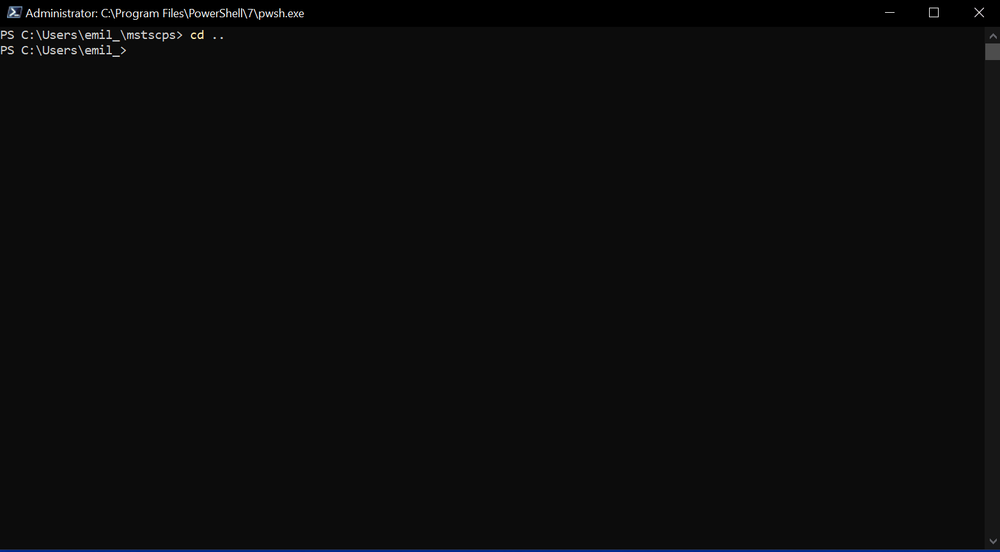

# mstscps, in development!
Wrapper for Mstsc

Setup steps:  
1. Install https://www.powershellgallery.com/packages/Microsoft.PowerShell.SecretManagement/
2. Set up a keyvault (I use keepass)
3. Import mstscps and create a Sessions.csv on a desired Path, use Set-MstscSessionPath
5. Create a new alias in your PSProfile for a short name for Connect-MstscSession
6. alias -Name SERVER -Secret SecretName

# Main ideas for project
Mstsc, Cmdkey, Out-ConsoleGridView, SecretManagement  
Fast RDP sessions for pre-defined list of hosts, tab-complete name, multiple connections per secret
